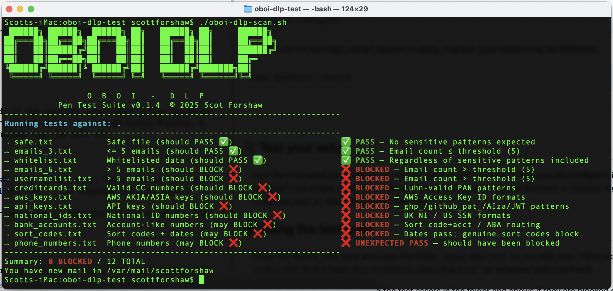
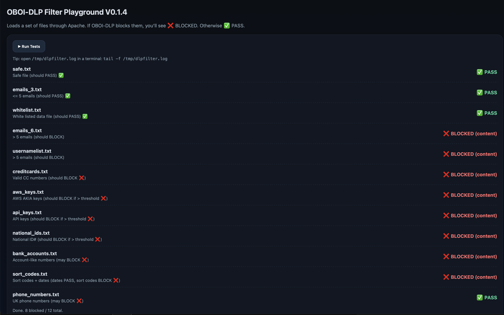

# ⌨️ oboi&trade; Data Leak Protection (DLP)


**oboi-dlp** is an Apache (and NGINX) external filter for Data Leak Prevention (DLP) that inspects HTTP request and response bodies in real time, applying configurable rules for blocking, logging, or alerting on sensitive data.

## 🚀 Quick Install

```bash
brew tap forshaws/homebrew-oboi-dlp
brew install oboi-dlp
```

## 🎯 Setup Overview

After installation, you need to:

1. **Enable Apache's `mod_ext_filter`** module
2. **Configure Apache to use the `oboi-dlp` binary**
3. **Verify `oboi-dlp.conf` is accessible**

---

## 🍎 macOS Configuration

### Binary & Config Locations

| Architecture | Apache Config | oboi-dlp.conf | Binary |
|--------------|---------------|---------------|--------|
| Intel Macs | `/usr/local/etc/httpd` | `/usr/local/etc/oboi-dlp.conf` | `/usr/local/bin/oboi-dlp` |
| Apple Silicon | `/opt/homebrew/etc/httpd` | `/opt/homebrew/etc/oboi-dlp.conf` | `/opt/homebrew/bin/oboi-dlp` |

### Apache Configuration

Add to your `httpd.conf`:

```apache
# Enable external filter module
LoadModule ext_filter_module lib/httpd/modules/mod_ext_filter.so

# OBOI-DLP Filter Definition
ExtFilterDefine dlpfilterin mode=input cmd="/opt/homebrew/bin/oboi-dlp --mode=input" preservescontentlength
ExtFilterDefine dlpfilterout mode=output cmd="/opt/homebrew/bin/oboi-dlp --mode=output" preservescontentlength

<Location "/">
    SetInputFilter dlpfilterin
    SetOutputFilter dlpfilterout
</Location>

# Optional: Custom log paths (create these files first with proper permissions)
#SetEnv OBOI_DLP_SYSTEMLOGPATH /usr/local/var/log/dlpfilter.log
#SetEnv OBOI_DLP_CAPALOGPATH /usr/local/var/log/capa.log

# Optional: ntfy.sh notifications
#SetEnv OBOI_DLP_TOPIC "your_topic_name_here"

# Optional: API key for licensed features
#SetEnv OBOI_DLP_APIKEY="YOUR_API_KEY_GOES_HERE"

```

**Note:** Update the binary path based on your architecture (Intel: `/usr/local/bin/oboi-dlp`, Apple Silicon: `/opt/homebrew/bin/oboi-dlp`)

### macOS Troubleshooting

- Run `apachectl configtest` after configuration changes
- Ensure you're using the correct paths for your architecture
- If running multiple Apache instances, verify Homebrew Apache is active: `brew services restart httpd`

---

## 🐧 Linux Configuration

### Distribution-Specific Paths


| Architecture | Apache Config/root | oboi-dlp.conf | Binary |
|--------------|-------------------|---------------|--------|
| RHEL/CentOS/<br>Fedora | `/etc/httpd/conf/`<br>`httpd.conf` | `/home/linuxbrew/.linuxbrew/`<br>`etc/oboi-dlp.conf` | `/home/linuxbrew/.linuxbrew/`<br>`bin/oboi-dlp` |
| Ubuntu/<br>Debian | `/etc/apache2/` | `/home/linuxbrew/.linuxbrew/`<br>`etc/oboi-dlp.conf` | `/home/linuxbrew/.linuxbrew/`<br>`bin/oboi-dlp` |

### RHEL/CentOS/Fedora Setup

Add to `/etc/httpd/conf/httpd.conf`:

```apache
LoadModule ext_filter_module modules/mod_ext_filter.so

# OBOI-DLP Configuration
ExtFilterDefine dlpfilterin mode=input cmd="/home/linuxbrew/.linuxbrew/bin/oboi-dlp --mode=input" preservescontentlength
ExtFilterDefine dlpfilterout mode=output cmd="/home/linuxbrew/.linuxbrew/bin/oboi-dlp --mode=output" preservescontentlength

<Location "/">
    SetInputFilter dlpfilterin
    SetOutputFilter dlpfilterout
</Location>

# Optional: Custom log paths (create these files first with proper permissions)
#SetEnv OBOI_DLP_SYSTEMLOGPATH /usr/local/var/log/dlpfilter.log
#SetEnv OBOI_DLP_CAPALOGPATH /usr/local/var/log/capa.log

# Optional: ntfy.sh notifications
#SetEnv OBOI_DLP_TOPIC "your_topic_name_here"

# Optional: API key for licensed features
#SetEnv OBOI_DLP_APIKEY="YOUR_API_KEY_GOES_HERE"

```

### Ubuntu/Debian Setup

1. **Enable the module:**
   ```bash
   sudo a2enmod ext_filter
   ```

2. **Create filter configuration:**
   ```bash
   sudo nano /etc/apache2/mods-available/ext_filter.conf
   ```

   Add:
   ```apache
   # OBOI-DLP Configuration
   ExtFilterDefine dlpfilterin mode=input cmd="/home/linuxbrew/.linuxbrew/bin/oboi-dlp --mode=input" preservescontentlength
   ExtFilterDefine dlpfilterout mode=output cmd="/home/linuxbrew/.linuxbrew/bin/oboi-dlp --mode=output" preservescontentlength

   <Location "/">
       SetInputFilter dlpfilterin
       SetOutputFilter dlpfilterout
   </Location>

   # Optional: Custom log paths (create these files first with proper permissions)
   #SetEnv OBOI_DLP_SYSTEMLOGPATH /usr/local/var/log/dlpfilter.log
   #SetEnv OBOI_DLP_CAPALOGPATH /usr/local/var/log/capa.log
 
   # Optional: ntfy.sh notifications
   #SetEnv OBOI_DLP_TOPIC "your_topic_name_here"
 
   # Optional: API key for licensed features
   #SetEnv OBOI_DLP_APIKEY="YOUR_API_KEY_GOES_HERE"
   ```

3. **Reload Apache:**
   ```bash
   sudo systemctl reload apache2
   ```

### Linux Security Considerations

- **SELinux (RHEL/CentOS/Fedora):** May require additional permissions
- **AppArmor (Ubuntu/Debian):** Generally more permissive for standard operations
- **systemd PrivateTmp:** Check if Apache has private temp namespace that could affect file operations. See the **PrivateTmp & oboi-dlp** section for detailed information.

---
### NGINX Configuration

OBOI-DLP works seamlessly with NGINX, but its setup is slightly different from Apache.  
Because NGINX does not use `mod_ext_filter`, you will need to configure a **proxy wrapper** (located in the repository folder /nginx that forwards traffic to OBOI-DLP for inspection. Follow these general steps:

These instructions assume you have a running NGINX instance and are familliar at least with how it operates and where your configurations live. There are so many persobalised configurations of NGINX that we leave the details to you on how you want oboi-dlp to handle filtering. This example therfore is a minimum viable install and will filter everything being served from root / web folder. You can alter the location, handle virtual hosts and https if you wish.

**Step 1:** Update Your NGINX Configuration

Edit your main NGINX config (usually /etc/nginx/nginx.conf or /etc/nginx/sites-enabled/*)
Add the following location block:

```bash
location / {
    proxy_pass http://127.0.0.1:8081;
    proxy_set_header Host $host;
    proxy_set_header X-Real-IP $remote_addr;
    proxy_set_header X-Forwarded-For $proxy_add_x_forwarded_for;
    proxy_buffering off;
}
```
The above location block will tell NGINX to proxy pass every request in / or hoigher of your web root via oboi-dlp. The oboi-dlp wrapper listening on port 8081 will call oboi-dlp and handle the return or blocking.

### Step 2: Install the OBOI-DLP wrapper
```bash
sudo mkdir -p /opt/oboi-dlp-wrapper/
sudo cp oboi-wrapper.py /opt/oboi-dlp-wrapper/
```
### Step 3: Configure environment and run the wrapper manually

NGINX handles environment variables slightly differently than Apache. The noraml ``Setenv`` directive is not used. To set the environment variables that oboi-dlp expects to see, the easist way is inside the provided proxy wrapper. 

Open the wrapper with your editor: 
```bash
sudo nano /opt/oboi-dlp-wrapper/oboi-wrapper.py
```
on line 6 and 7 you will see two placeholder keys. Uncomment the key and replace the placeholder with your APIKEY or NTFY TOPIC as per the Apache instructions. 

```ini
#env["OBOI_DLP_APIKEY"] = "YOUR_API_KEY_GOES_HERE" 
#env["OBOI_DLP_TOPIC"] = "your_topic_name_here"
```

Once you have set the env variable (optional - see Apache instructions related to all env vars used) you can run the wrapper.

```bash
python3 /opt/oboi-dlp-wrapper/oboi-wrapper.py
```

At this point the oboi-wrapper will begin listening on port 8081 - the port that NGINX will use to talk to oboi-dlp. It is worth remonding the user tat the oboi-wrapper.py can be modified to alter the default behaviours and handle custom error pages.


**Note**
- Update the OBOI-DLP binary path in oboi-wrapper.py based on your architecture (common vlaues are):
- Intel (x86_64): /usr/local/bin/oboi-dlp
- Apple Silicon (arm64): /opt/homebrew/bin/oboi-dlp
- Linux (Debian): /home/linuxbrew/.linuxbrew/bin/oboi-dlp

### Step 4: Restart NGINX to apply changes
```bash
sudo systemctl restart nginx
```
or

```bash
sudo service nginx restart
```

### Troubleshooting NGINX

- Wrapper not responding: Ensure oboi-wrapper.py is running and listening on port 8081
- Permission issues: Make sure wrapper and OBOI-DLP binary are executable and readable by the NGINX user (www-data)
- Port conflicts: If port 8081 is in use, change both the wrapper's port and the NGINX proxy_pass

--- 

## 📁 Working Directory

oboi-dlp automatically creates its working directory at `/var/tmp/oboi-dlp` with appropriate permissions for both user and Apache execution contexts. This location provides:

- Cross-platform compatibility (Linux & macOS)
- Persistence across reboots
- Proper web server access permissions

### ⚠️ PrivateTmp & oboi-dlp
Many Apache installs are configured to use `PrivateTmp=on` and oboi-dlp is designed to handle this without any changes to your security posture. **note** - no amount of chmod/chown will overide PrivateTmp. The first time oboi-dlp is called by Apache (or other calling process/server) it will try and determine if it can use `/var/tmp/oboi-dlp` to build its instal files. If PrivateTmp is on, it will build these files in the private directory space. For most systems this will be a folder named something like `/var/tmp/system.d-xxxxxxxxx-apache2/var/tmp/oboi-dlp/`. You can create a symlink to the oboi-dlp log files insode this folder to tail them or copy them to a locally writeable folder if you need this.

---

## ⚙️ Configuration File

The `oboi-dlp.conf` file controls DLP rules and thresholds:

```ini
API Key = on,0
AWS Key = on,0
AWS Temp Key = on,0
Credit Card = on,0
National ID = on,0
Sort Code = on,10
UK Bank Account = off,5
US Bank Account = off,5
Phone Number=off,10
Phone Number USA=off,10
MySQL Error = on,0
SQL Statement Echo = on,0
Email Threshold = 5
Whitelist URIs = on,/status,/healthcheck,/oboi-dlp-test/whitelist.txt
```


Format: `<RULE_NAME> = <on/off/R>, <threshold>`


## New in 0.2.3 - 'R' switch in filters
From v0.2.3 the user can now use a new filter switch 'R'. The 'R' signals to oboi-dlp to apply blocking hierarchy of BLOCK/RESTRICT/PASS. If the rule triggers AND no other rule causes a BLOCK, then oboi-dlp will return 

``Access Restricted <data>,<data>,...`` where the <data> fields are 1 or more (limit 200 chars) abolute values that are returned to the calling process for further checking. This feature supports streaming LLM functionality and TQNN SIE protocols when used with NGINX wrappers.


```ini
Custom Regex InternalTicket = \bTICKET-[0-9]{6}\b
InternalTicket = R,0
```

Format: `Custom Regex <RULE_NAME> = <expression>`

Custom rules can be kept in config and turned on off using their RULE_NAME like so this `<RULE_NAME> = on,<threshold>`


## New in 0.2.2 - custom filters
From v0.2.2 the user can now set custom rules in the oboi-dlp.conf (use sparingly they have an overhead).
```ini
Custom Regex InternalTicket = \bTICKET-[0-9]{6}\b
InternalTicket = on,0
```

Format: `Custom Regex <RULE_NAME> = <expression>`

Custom rules can be kept in config and turned on off using their RULE_NAME like so this `<RULE_NAME> = on,<threshold>`


---

## 📊 Logging & Notifications

### Custom Log Files

If using custom log paths, create them with proper permissions:

```bash
# macOS
touch /usr/local/var/log/{capa.log,dlpfilter.log}
sudo chgrp _www /usr/local/var/log/{capa.log,dlpfilter.log}
chmod 0770 /usr/local/var/log/{capa.log,dlpfilter.log}

# Linux
touch /var/log/{capa.log,dlpfilter.log}
sudo chgrp www-data /var/log/{capa.log,dlpfilter.log}  # Ubuntu/Debian
sudo chgrp apache /var/log/{capa.log,dlpfilter.log}    # RHEL/CentOS
chmod 0770 /var/log/{capa.log,dlpfilter.log}
```

### Viewing Logs

```bash
# Default location
tail -f /var/tmp/oboi-dlp/{capa.log,dlpfilter.log}

# Custom location
tail -f /usr/local/var/log/capa.log

# Colored CAPA alerts
tail -f /var/tmp/oboi-dlp/capa.log | sed 's/^/\x1b[31m[CAPA]\x1b[0m /'
```

Example of tailing CAPA logs with colour coding


### ntfy.sh Notifications

Enable real-time alerts by setting your ntfy topic:

```apache
SetEnv OBOI_DLP_TOPIC "your_secret_topic_name"
```

---

## 🧪 Testing

### Automated Test Suite

The installation includes a comprehensive test suite. Copy `oboi-dlp-test/` to your web root and access:

- **Web interface:** `http://your-server/oboi-dlp-test/test_oboi_dlp.html`
- **Command line:** `./oboi-dlp-scan.sh`

**⚠️ Remove the test suite after verification**

The command line interface


The web interface


### Manual Testing

Test DLP functionality by serving files containing sensitive data patterns. Blocked requests will return "Access Blocked" and generate CAPA log entries.

---

## 🔧 Useful Commands

### Apache Management
```bash
# Test configuration
apachectl configtest

# Restart services
sudo systemctl restart apache2    # Linux
sudo apachectl restart           # macOS

# View logs
tail -f /var/log/apache2/error.log    # Ubuntu/Debian
tail -f /var/log/httpd/error_log      # RHEL/CentOS
tail -f /usr/local/var/log/httpd/error_log  # macOS
```

### Service Management
```bash
# Linux
sudo systemctl {start|stop|restart|status} apache2
sudo systemctl {start|stop|restart|status} httpd

# macOS
brew services {start|stop|restart} httpd
```

---

## 🔐 Licensing


**oboi-dlp** is a commercial software product and requires a valid API key to function fully. Visit [toridion.com/oboi-dlp](https://toridion.com/oboi-dlp/) to obtain a commerical license API key.


Set your license key in Apache configuration:

```apache
SetEnv OBOI_DLP_APIKEY="YOUR_API_KEY_GOES_HERE"
```
Once you have entered your API Key you should restart apache.

## 🦉 Community and Trial Modes


**oboi-dlp** has a free trial mode for new user inbuilt. Simply install it using the instructions above and the software will register itself and allow you to use the full features of the Dev/Enterprise Pro version to evaluate it.

After the trial ends **oboi-dlp** will revert to **community edition** - a cut down version that is not licesed for use on production systems. You can use community edition for free or upgrade at anytime to a commercial license and restore the paid for features.


---

## 🚮 Uninstall

Basic uninstall

```bash
brew uninstall oboi-dlp
brew untap forshaws/homebrew-oboi-dlp
```

Deep uninstall with cache clearing - can help sometimes if you have meddled.

```bash
brew uninstall oboi-dlp
brew cleanup -s
rm -f "$(brew --cache)"/oboi-dlp-*
brew info oboi-dlp
find /usr/local -name "*oboi-dlp*" 2>/dev/null
find /opt/homebrew -name "*oboi-dlp*" 2>/dev/null
find ~/Library/Caches/Homebrew -name "*oboi-dlp*" 2>/dev/null
find ~/Library/Logs/Homebrew -name "*oboi-dlp*" 2>/dev/null
brew untap forshaws/homebrew-oboi-dlp
```

Remove configuration from `httpd.conf` and restart Apache.

---

## 🌟 Features

- **Automated DLP Protection** - Blocks sensitive data exfiltration
- **Real-time Processing** - Filters HTTP requests/responses as they happen  
- **Configurable Rules** - Customizable detection thresholds
- **Multi-platform** - Works on macOS and Linux
- **Enterprise Integration** - IMS/QMS audit exports
- **Instant Alerts** - ntfy.sh notifications for critical events
- **Conditional Restrictions** - flag sensitive content for redaction post filtering
---

**Version 0.2.3** | For support and documentation: [toridion.com/oboi-dlp](https://toridion.com/oboi-dlp/)