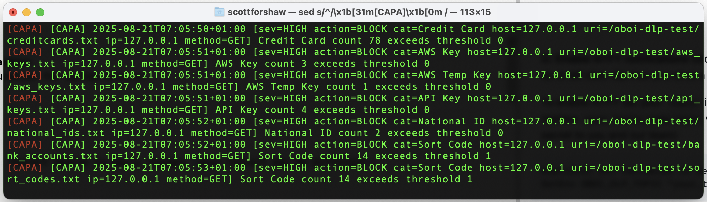

# ⌨️ oboi&trade; Data Leakage Protection (DLP)


## ⚡️ TL;DR Install Overview
**oboi-dlp** is an Apache external filter for Data Loss Prevention (DLP).  
It inspects HTTP request and response bodies in real time and applies configurable rules for blocking, logging, or alerting.  

Run these commands in your terminal to install:

```bash
brew tap forshaws/homebrew-oboi-dlp
brew install oboi-dlp
```


Once you’ve run the Homebrew install, there are three main goals before oboi-dlp is protecting your Apache traffic:

1. **Enable Apache’s** `mod_ext_filter` so we can hook into input/output streams.
2. **Point Apache at the `oboi-dlp` binary** `(ExtFilterDefine …)`.
3. **Ensure `oboi-dlp.conf` is found and logs are writable.**
#

# 🍎 macOS (Intel & Apple Silicon M1)
**Apache locations (Brew install)**

- **Intel Macs:**  
  - Apache root: `/usr/local/etc/httpd`  
  - oboi-dlp.conf: `/usr/local/etc/oboi-dlp.conf`  
  - Binary: `/usr/local/bin/oboi-dlp`

- **M1 Macs:**  
  - Apache root: `/opt/homebrew/etc/httpd`  
  - oboi-dlp.conf: `/opt/homebrew/etc/oboi-dlp.conf`  
  - Binary: `/opt/homebrew/bin/oboi-dlp`


**Typical config snippet `(httpd.conf)`**
```ini
LoadModule ext_filter_module lib/httpd/modules/mod_ext_filter.so


#Uncomment the lines below if you want custom logs or ntfy support

#optional env variables to set a ntfy.sh topic. See https://docs.ntfy.sh/
#SetEnv OBOI_DLP_TOPIC "your_topic_name_here"

#optional env variables to set oboi log paths
#SetEnv OBOI_DLP_SYSTEMLOGPATH /usr/local/var/log/dlpfilter.log
#SetEnv OBOI_DLP_CAPALOGPATH /usr/local/var/log/capa.log

#set oboi-dlp API KEY (if purchased) See https://toridion.com/oboi-dlp for details
#SetEnv OBOI_DLP_APIKEY="YOUR_API_KEY_GOES_HERE"

# OBOI-DLP Configuration
ExtFilterDefine dlpfilterin mode=input  cmd="/opt/homebrew/bin/oboi-dlp --mode=input"  preservescontentlength
ExtFilterDefine dlpfilterout mode=output cmd="/opt/homebrew/bin/oboi-dlp --mode=output" preservescontentlength

<Location "/">
    SetInputFilter dlpfilterin
    SetOutputFilter dlpfilterout
</Location>
```
## ✅ Pitfalls on Mac

- Forgetting to run `apachectl configtest` after edits.
- Mixing Intel vs M1 paths (`/usr/local` vs `/opt/homebrew`).
- Launchd service collisions: if both **Apple’s built-in Apache** and Brew Apache are installed, make sure the Brew one is running (```brew services restart httpd```).


**⚠️IMPORTANT⚠️ custom logs will need to be created by you first**

Example:
```bash
touch /usr/local/var/log/capa.log
touch /usr/local/var/log/dlpfilter.log
sudo chgrp _www capa.log
sudo chgrp _www dlpfilter.log
chmod 0770 capa.log
chmod 0770 dlpfilter.log
```

If you set the env in httpd.conf then oboi-dlp will try top use the logs you say (as long as they are there)

#


# 🐧 Linux
Depending on your distro/version, Apache may use either a **classic monolithic** `httpd.conf` or the **Debian/Ubuntu-style modular config system** (`sites-available/` + `sites-enabled/`).

**Classic (CentOS/RHEL/Fedora, some Ubuntus)**
- Apache root: `/etc/httpd/`
- Config: `/etc/httpd/conf/httpd.conf`
- Binary: `/home/linuxbrew/.linuxbrew/bin/oboi-dlp` (if installed via Brew)
- `oboi-dlp.conf`: `/home/linuxbrew/.linuxbrew/etc/oboi-dlp.conf`

Add at end of `httpd.conf`:
```ini
LoadModule ext_filter_module modules/mod_ext_filter.so


#Uncomment the lines below if you want custom logs or ntfy support

#optional env variables to set a ntfy.sh topic. See https://docs.ntfy.sh/
#SetEnv OBOI_DLP_TOPIC "your_topic_name_here"

#optional env variables to set oboi log paths
#SetEnv OBOI_DLP_SYSTEMLOGPATH /usr/local/var/log/dlpfilter.log
#SetEnv OBOI_DLP_CAPALOGPATH /usr/local/var/log/capa.log

#set oboi-dlp API KEY (if purchased) See https://toridion.com/oboi-dlp for details
#SetEnv OBOI_DLP_APIKEY="YOUR_API_KEY_GOES_HERE"

ExtFilterDefine dlpfilterin  mode=input  cmd="/home/linuxbrew/.linuxbrew/bin/oboi-dlp --mode=input"  preservescontentlength
ExtFilterDefine dlpfilterout mode=output cmd="/home/linuxbrew/.linuxbrew/bin/oboi-dlp --mode=output" preservescontentlength

<Location "/">
    SetInputFilter dlpfilterin
    SetOutputFilter dlpfilterout
</Location>
```

**Debian/Ubuntu (modular config)**
- Apache root: `/etc/apache2/`
- Module configs: `/etc/apache2/mods-available/` → enabled via symlink in `/etc/apache2/mods-enabled/`
- Virtual hosts: `/etc/apache2/sites-available/` → symlinked into `/etc/apache2/sites-enabled/`
- Binary: `/home/linuxbrew/.linuxbrew/bin/oboi-dlp`
- `oboi-dlp.conf`: `/home/linuxbrew/.linuxbrew/etc/oboi-dlp.conf`

Steps:
**1.** Enable module:
```bash
sudo a2enmod ext_filter
```

**2.** Create `/etc/apache2/mods-available/ext_filter.conf` adding the lines:


```bash
nano /etc/apache2/mods-available/ext_filter.conf
```
Then add the lines:
```ini

#Uncomment the lines below if you want custom logs or ntfy support

#optional env variables to set a ntfy.sh topic. See https://docs.ntfy.sh/
#SetEnv OBOI_DLP_TOPIC "your_topic_name_here"

#optional env variables to set oboi log paths
#SetEnv OBOI_DLP_SYSTEMLOGPATH /usr/local/var/log/dlpfilter.log
#SetEnv OBOI_DLP_CAPALOGPATH /usr/local/var/log/capa.log

#set oboi-dlp API KEY (if purchased) See https://toridion.com/oboi-dlp for details
#SetEnv OBOI_DLP_APIKEY="YOUR_API_KEY_GOES_HERE"

# OBOI-DLP Configuration
ExtFilterDefine dlpfilterin  mode=input  cmd="/home/linuxbrew/.linuxbrew/bin/oboi-dlp --mode=input"  preservescontentlength
ExtFilterDefine dlpfilterout mode=output cmd="/home/linuxbrew/.linuxbrew/bin/oboi-dlp --mode=output" preservescontentlength

<Location "/">
    SetInputFilter dlpfilterin
    SetOutputFilter dlpfilterout
</Location>

```
**3.** Enable it by saving the file and reloading apache2:

```bash
sudo systemctl reload apache2
```

## ✅ Pitfalls on Linux
- Forgetting `a2enmod ext_filter` (Ubuntu/Debian).
- Apache not running as the same user that can read/write log paths (`/tmp`, `/var/log/`, etc.).
- Mixing Brew binary path (`/home/linuxbrew/.linuxbrew/bin`) with system binaries.
- On systems with **AppArmor/SELinux**, extra permissions may be needed for Apache to execute `oboi-dlp`.
- Running oboi-dlp in user mode may cause it to create install files that will not be writeable by Apache invoked oboi-dlp. You should try and let oboi-dlp create its own install tmp folder in `/tmp/oboi-dlp/` that will be writeable by Apache and the software.


**⚠️IMPORTANT⚠️ custom logs will need to be created by you first**

Example:
```bash
touch /usr/local/var/log/capa.log
touch /usr/local/var/log/dlpfilter.log
sudo chgrp _www capa.log
sudo chgrp _www dlpfilter.log
chmod 0770 capa.log
chmod 0770 dlpfilter.log
```

If you set the env in httpd.conf then oboi-dlp will try top use the logs you say (as long as they are there)

----
**Longer version and extra settings,mwhitelists and notifications**

# 🌟 What is DLP - and what is oboi-dlp? 
**oboi-dlp;** is a DLP filter that protects your data from being leaked to third parties becuase of error, ommission or undetected vulnerabilities in your system. **oboi-dlp** installs as a Apache module that intelligently filters inbound and outbound payloads and blocks them from being served if they contain sensitive data. It also notifies you if exfiltration blocking has happened, then formats these notifications in to weekly audit reports that will import easily into your IMS (integrated Quality Management System) for compliance and quality reporting.

**oboi-dlp** has the ability to utilise TORIDION's TQNN FraudTagger scoreUsername API to detect POST payloads contaning email/usernames and validate against their enterprise fraud detection model at server level rather than code level. This added protection helps your web service/api/mobile apps flag or even block suspicious emails. Existing oboi licenses will be detected and used without further configuration!


## ⚙️ Version 0.1.5

⦿ **oboi-dlp still in beta**

## 🌟 Features 

⦿ **Major data types protected automatically** blocks exfiltration of sensitive data

⦿ **Out of the box exfil DLP** for Apache and all connected surfaces (Mysql/RDS/AWS/S3)

⦿ **Easy IMS/QMS Audit Export** Exports IMS ready audits for your compliance system

⦿ **Notifications of critical events** get notified of xfil events as they happen

⦿ **HTTP_POST payload  fraud scan** at server level to detect/block spoofers

⦿ **Email/Username scoring** against enterprise grade fraud detection API


## 💻 Beta Status

This software is in non commerical beta until this notice is removed

## ⚙️ Installation Instructions

### **Step 1: Install the tap and oboi-dlp**
Run these commands in your terminal to install:

```bash
brew tap forshaws/homebrew-oboi-dlp
brew install oboi-dlp
```

That concludes the installation of oboi-dlp binaries and test suite.

------

### **Step 2: Enable oboi-dlp in Apache**

In Step 1, you installed the **oboi-dlp** software. Now, you simply need to enable it in Apache.

How you setup Apache on your system will dictate how you need to proceed. 


### **Installation**
 by finding your active ```httpd.conf``` file and adding the required lines.

**A: Locate your Apache installation**
<br />Run:

```bash
which httpd
```
or
```bash
apachectl -V | grep HTTPD_ROOT
```

This will tell you where Apache is installed.

**B: Find your active httpd.conf**

Run:

```bash
apachectl -V | grep SERVER_CONFIG_FILE
```

For example, the output might be:
```ini
SERVER_CONFIG_FILE="/usr/local/etc/httpd/httpd.conf"
```
You can open it directly with:
```bash
nano $(apachectl -V | grep SERVER_CONFIG_FILE | cut -d'"' -f2)
```

**C: Enable the required Apache modules**

Inside httpd.conf, ensure this line is uncommented (remove the # if present):

```apache
LoadModule ext_filter_module lib/httpd/modules/mod_ext_filter.so
```
**note** the module path may differ from ```lib/httpd/modules/```. The important thing is to find the start of the line <br /> 
```#LoadModule ext_filter_module``` and uncomment it.


**D: Add oboi-dlp configuration**

Towards bottom of your ```httpd.conf```, add:

```ini
#Uncomment the lines below if you want custom logs or ntfy support

#optional env variables to set a ntfy.sh topic. See https://docs.ntfy.sh/
#SetEnv OBOI_DLP_TOPIC "your_topic_name_here"

#optional env variables to set oboi log paths
#SetEnv OBOI_DLP_SYSTEMLOGPATH /usr/local/var/log/dlpfilter.log
#SetEnv OBOI_DLP_CAPALOGPATH /usr/local/var/log/capa.log

#set oboi-dlp API KEY (if purchased) See https://toridion.com/oboi-dlp for details
#SetEnv OBOI_DLP_APIKEY="YOUR_API_KEY_GOES_HERE"

# OBOI-DLP Configuration

ExtFilterDefine dlpfilterin mode=input cmd="/usr/local/bin/oboi-dlp --mode=input" preservescontentlength
ExtFilterDefine dlpfilterout mode=output cmd="/usr/local/bin/oboi-dlp --mode=output" preservescontentlength


<Location "/">
    SetInputFilter dlpfilterin
    SetOutputFilter dlpfilterout
    
    # Export some request metadata for oboi-dlp
    SetEnvIf Request_URI ".*" DLP_URI=$0
    SetEnvIf Host ".*" DLP_HOST=$0
    
</Location>


```


Save the file and exit Nano.

**E: Configure the DLP Filter**
During install Homebrew will install a default ```oboi-dlp.conf``` file in your Homebrew’s etc path (normally ```/usr/local/etc``` or ```/opt/homebrew/etc```), not directly /etc. On startup oboi-dlp will find this file and load it. If it does not exist or is in not in the default directory then oboi-dlp will print a warning in the ```dlpfiler.log``` file.

You can check this log file by running"

```bash
tail -f /tmp/dlpfilter.log

```
Look for the log entry that looks like this that indicates a conf path error: 

```ini
2025-08-16T10:00:44+01:00 Config file not found, using defaults
```
The configuration file is a simple format :-

< KEYNAME > = < on/off >, < Threshold (int)>. Setting it ot off means that oboi-dlp will not test this filter.

The exceptions are ```Email Threshold``` and ```Whitelist URIs```.

Email Thresold is a INT setiing that controls how many emails oboi-dlp will allow to be served in one serve.

Whitelist URIs, is a comma separated list of endpoints that are excluded from oboi-dlp processing. ```whitelist.txt``` is included in the default setup to allow the oboi-dlp penetration testing scripts and tests to function. You can safely remove later.

```
API Key = on,0
AWS Key = on,0
AWS Temp Key = on,0
Credit Card = on,0
National ID = on,0
Sort Code = on,10
UK Bank Account = on,5
US Bank Account = on,5
Phone Number=on,10
Phone Number USA=on,10
Email Threshold = 5
Whitelist URIs = /status,/healthcheck,/whitelist.txt
```

```etc.install``` will put it in Homebrew’s etc path (normally ```/usr/local/etc``` or ```/opt/homebrew/etc```), not directly /etc.
Open the conf file by running: 

```bash
nano /opt/homebrew/etc/oboi-dlp.conf
```

or 

```bash
nano /usr/local/etc/oboi-dlp.conf
```

Edit the file if you wish, and save with ^O and exit ^X.

<br />


**F: System and CAPA Log Files:** oboi-dlp outputs critical evens like intrusions and attempts to access sensitive date in the ```capa.log``` and system related events in ```dlpfilter.log```. Initially these logs will be created in your ```/tmp``` folder. You can change this behaviour once you are happy that oboi-dlp is working as you expect. 

Due to the sheer number of ways sysadmins may want to use the logs, we left this up to the user. To make life easy for you, oboi-dlp looks for an environment variable for each of the logs.  For ```capa.log``` the env is ```OBOI_DLP_CAPALOGPATH```. For the ```dlpfilter.log``` the env is ```OBOI_DLP_SYSTEMLOGPATH```. The env paths are ideally set in the Apache ```httpd.conf``` (**see section D**) for details of that.


For example, you can set the path to something like ```/usr/local/var/log/capa.log```. Just rememebr to update the permissisons so that oboi-dpl can access it. The ```httpd.conf``` extract below shows the ```capa.log``` enabled  by way of renoveing the # (Uncommenting the line)

```ini
#optional env variables to set oboi log paths
#SetEnv OBOI_DLP_SYSTEMLOGPATH /usr/local/var/log/dlpfilter.log
SetEnv OBOI_DLP_CAPALOGPATH /usr/local/var/log/capa.log
```

Similarly the CAPA log can be set to a custom path using something like:
```bash
export OBOI_DLP_CAPALOGPATH=/var/log/capa.log 
```

Once oboi-is running you can look at the capa log using something like:

```bash
tail -f /tmp/capa.log
```

or in the latter case of a custom log 
```bash
tail -f /usr/local/var/log/capa.log
```

You can add fancy logging to you tail by making the [CAPA] events **RED** in colour
```bash
 tail -f /usr/local/var/log/capa.log | sed 's/^/\x1b[31m[CAPA]\x1b[0m /'
 ```


**⚠️IMPORTANT⚠️ custom logs will need to be created by you first**

Example:
```bash
touch /usr/local/var/log/capa.log
touch /usr/local/var/log/dlpfilter.log
sudo chgrp _www capa.log
sudo chgrp _www dlpfilter.log
chmod 0770 capa.log
chmod 0770 dlpfilter.log
```

If you set the env in httpd.conf then oboi-dlp will try top use the logs you say (as long as they are there)

**G: Enable NTFY notifications**
oboi-dlp is designed to work seamlessly with the popular ntfy.sh notification engine. All you need to do is tell oboi-dlp that you ahve a valid ```topic``` and it will automtically send critical alerts to that topic!

To enable NTFY  set your ```topic``` in the Apache ```httpd.conf``` (**see section D**) for details of accessing that. Uncomment the line and replace ```your_topic_name_here``` with the name of your ntfy topic. (The topic is yours, ideally it should be hard to guess and quite secret to you and our team)

```ini
#optional env variables to set a ntfy.sh topic
SetEnv OBOI_DLP_TOPIC "your_topic_name_here"

```

**H: Test and restart Apache**
Check your Apache configuration for syntax errors:


```bash
apachectl configtest
```
If there are no warnings, restart Apache to apply changes (your restart may be different):
```bash
sudo apachectl restart
```

## **🛠 Test your setup**

oboi-dlp is invoked automatically by Apache when a file is served. If the oboi-dlp intelligent filter determine the data in the file to be sensitive it will simply block it outright and serve the message Access Blocked. A ```[CAPA]``` log entry will be added to you ```/tmp/cap.log``` or whatever log you have set. 

## **💻 Using the test suite**

Clone the repo to your local and copy the folder ```obpoi-dlp-test``` to you web root. There are several tools in there. Paticularly ```http://127.0.0.1/oboi-dlp-test/test_oboi_dlp.html``` (or whatever path you have).

FYI: The oboi-dlp-test folder is also bundles with brew pkg and you will see some instructions during install that more expert users may find easier.

The tool sequentially tries to load the test assets in the folder and shows if they are blocked or passed. Some should be passed according to the default oboi-dlp.conf.


There is also a bash version ```./oboi-dlp-scan.sh```. cd into your directory and run it form the command line.

```bash
./oboi-dlp-scan.sh
```

The output should be something like shown below.


**⚠️IMPORTANT⚠️ When you are happy the system is working REMOVE the test suite**


## **🛠 Useful Apache Commands**

Check Apache status:
```bash
sudo apachectl status
```

View Apache error log:

```bash
tail -f /usr/local/var/log/httpd/error_log
```

View Apache access log:
```bash
tail -f /usr/local/var/log/httpd/access_log
```

Stop Apache:
```bash 
sudo apachectl stop
```

Start Apache:
```bash
sudo apachectl start
```
Restart Apache:
```bash
sudo apachectl restart
```


## ⚙️ Uninstall Instructions  

Run this command in your terminal:

```bash
brew uninstall oboi-dlp
```


## 📧 Usage Instructions 

oboi-dlp&trade; 

**Recommended : Adding your apikey to the env**

By adding the apikey to your environment variables you can activate oboi-dlp license. If your apikey is set in env, then oboi-dlp just uses your api credits.** If no key is set in env or on the command line it will default to free trial mode**. 

oboi-dlp recommend adding your license key in the httpd.conf (**see section D**), Buy a license key and then add it in place of ```YOU_API_KEY_GOES_HERE``` and uncomment the line (remove the #).

```ini
#set oboi-dlp API KEY (if purchased) See https://toridion.com/oboi-dlp for details
SetEnv OBOI_DLP_APIKEY="YOUR_API_KEY_GOES_HERE"
```

Some Apache servers will see the standard env variables and you can add your key to the env the calssic way by using the following command **note we do not support you on this as there are too many things that can change. Use the method above for guaranteed success**:

```bash
export OBOI_DLP_APIKEY="YOUR_API_KEY_GOES_HERE"
```

Remove the key using the following command:

```bash
unset OBOI_DLP_APIKEY
```

## 🔐 Free Usage & Fair Use

**oboi-dlp** trial mode is free to use under the license for personal, educational, and prototyping purposes.

Usage beyond this will require a valid API license key, please [view the API plans](https://toridion.com/oboi-dlp/) for license details for commercial use. Trial mode is automatic and trial activation will be completed when the install completes and Apache tries to access oboi-dlp for the first time. 

By installing oboi-dlp you agree to this and to the terms of the license.